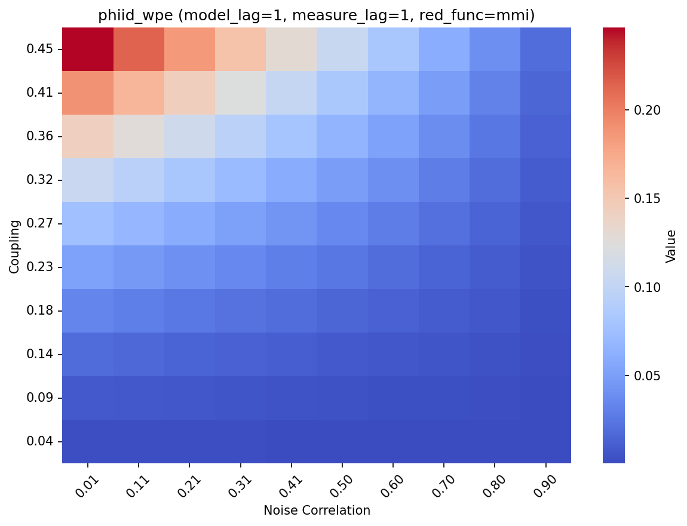
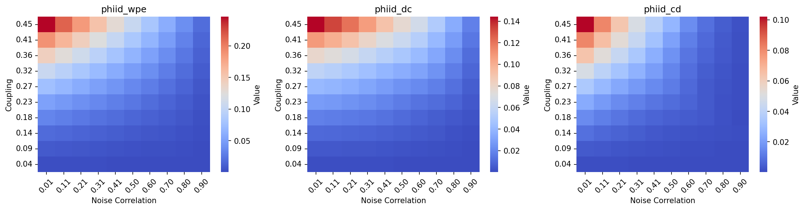
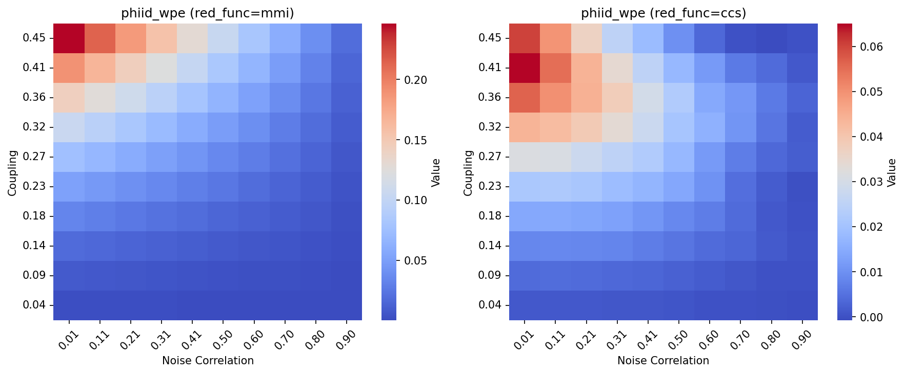
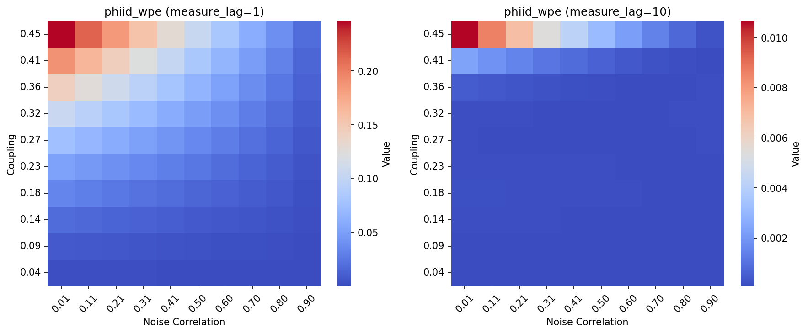

# Getting Started with ComplexPy

This guide walks you through your first emergence analysis with ComplexPy. By the end, you'll understand how to generate time-series data, compute emergence measures, and interpret the results.

For theoretical background, see [theory.md](theory.md). For technical details, see [architecture.md](architecture.md).

## Prerequisites

- ComplexPy installed (see [README installation section](../README.md#installation))
- 15-20 minutes
- Basic Python knowledge

## What We'll Do

We'll analyze a simple 2-node network to answer: **How does coupling strength affect emergence?**

Specifically:
1. Generate time-series data from a 2-node MVAR model
2. Compute emergence measures (Shannon or PhiID)
3. Interpret what the results mean
4. Visualize with heatmaps

---

## Step 1: Understanding the System

### The Model

We'll use a **2-node Multivariate Autoregressive (MVAR) model**:

```
X₁(t) = a·X₁(t-1) + c·X₂(t-1) + noise₁(t)
X₂(t) = c·X₁(t-1) + a·X₂(t-1) + noise₂(t)
```

Where:
- **X₁, X₂**: Two nodes (think of them as neurons)
- **a**: Self-coupling (how much each node depends on its own past)
- **c**: Cross-coupling (how much nodes influence each other)
- **noise**: Random fluctuations

**Macro variable**: V(t) = X₁(t) + X₂(t) (population activity)

### The Question

As we increase coupling **c**, do we see more emergence? That is, does the macro level (V) gain predictive information that the individual micros (X₁, X₂) lack?

---

## Step 2: Set Up Your Analysis

Create a new Python script or Jupyter notebook:

```python
import numpy as np
import complexpy as cp
import complexpy.data_simulation as ds
```

**What just happened?**
- MATLAB Engine started (this takes a few seconds on first import)
- ComplexPy modules loaded and ready

---

## Step 3: Define Your Models

Tell ComplexPy which time-series model you want to use:

```python
model_functions = {'2node_mvar': ds.generate_2node_mvar_data}
```

**Explanation**:
- `'2node_mvar'`: A name for this model (you choose this)
- `ds.generate_2node_mvar_data`: The function that generates the data

Now specify which parameters this model needs:

```python
model_variables = {
    '2node_mvar': [
        'coupling',           # Coupling strength between nodes
        'noise_corr',         # Noise correlation
        'time_lag_for_model', # Time lag in model dynamics
        'npoints',            # Number of time points
        'macro_func_mvar',    # Function to create macro variable
        'micro_func_mvar'     # Function to create micro variables
    ]
}
```

**Why?** ComplexPy needs to know which parameters to pass to `generate_2node_mvar_data()`.

---

## Step 4: Define Your Measures

Tell ComplexPy which emergence measures to compute:

```python
emergence_functions = {'shannon_wpe': cp.shannon_wpe}
```

**Why Shannon WPE?**
- Fast to compute
- Good for exploratory analysis
- Returns three measures: WPE (Ψ), DC (Δ), CD (Γ)

Now specify which parameters this measure needs:

```python
measure_variables = {
    'shannon_wpe': [
        'micro',              # Micro-level data
        'macro',              # Macro-level data
        'time_lag_for_measure' # Time lag for information measures
    ]
}
```

---

## Step 5: Set Parameter Values

Define the parameter space to explore:

```python
parameters = {
    # Model parameters
    'coupling': np.linspace(0.05, 0.45, num=10),  # 10 coupling values
    'noise_corr': [0.0, 0.5],                     # 2 noise correlations
    'time_lag_for_model': [1],                    # Model time lag
    'npoints': [2000],                            # 2000 time points

    # Measure parameters
    'time_lag_for_measure': [1],                  # Measure time lag

    # Functions for macro/micro variables
    'macro_func_mvar': [ds.sum_micro_mvar],       # Macro = sum of micros
    'micro_func_mvar': [ds.raw_micro_mvar]        # Micro = raw node values
}
```

**What's happening?**
- `coupling`: We'll test 10 values from 0.05 to 0.45
- `noise_corr`: We'll test both independent noise (0.0) and correlated noise (0.5)
- This creates 10 × 2 = **20 parameter combinations**

---

## Step 6: Compute Emergence

Now for the magic - one line of code:

```python
emergence_df = cp.compute_emergence(
    model_functions,
    model_variables,
    emergence_functions,
    measure_variables,
    parameters
)
```

**What ComplexPy does**:
1. For each of the 20 parameter combinations:
   - Generates 2-node MVAR data using the specified parameters
   - Computes macro variable (V = X₁ + X₂)
   - Computes Shannon WPE measures (Ψ, Δ, Γ)
2. Returns a pandas DataFrame with all results

**How long?** ~30 seconds for 20 combinations (varies by system)

---

## Step 7: Examine the Results

Let's see what we got:

```python
print(emergence_df.head())
```

Output (example):
```
   coupling  noise_corr  time_lag_for_model  ...  shannon_wpe  shannon_dc  shannon_cd
0      0.05         0.0                   1  ...        0.023       0.012       0.015
1      0.10         0.0                   1  ...        0.089       0.045       0.051
2      0.15         0.0                   1  ...        0.178       0.091       0.102
...
```

**Each row** is one parameter combination with its emergence measures.

### Columns Explained

**Parameters** (what we varied):
- `coupling`: Coupling strength
- `noise_corr`: Noise correlation

**Results** (what ComplexPy computed):
- `shannon_wpe` (Ψ): Whole-parts emergence
- `shannon_dc` (Δ): Downward causation
- `shannon_cd` (Γ): Causal decoupling

---

## Step 8: Understand the Results

**Expected patterns** in your data:
- Emergence increases with coupling strength
- At low coupling: nodes are nearly independent → low emergence
- At high coupling: nodes interact strongly → high emergence

See Step 12 for visualization examples.

---

## Step 9: Interpret the Results

### What Do These Numbers Mean?

**Whole-Parts Emergence (WPE / Ψ)**:
- Measures: Information at macro level not present in sum of micro parts
- `Ψ > 0`: Macro (V) has emergent predictive capacity
- Higher values: More emergence

**Example**: If `Ψ = 0.15 bits`:
- The macro variable's future has 0.15 bits of information
- This info is NOT present when we sum individual micro predictions
- The whole has information beyond the parts

**Downward Causation (DC / Δ)**:
- Measures: Macro influence on micro parts
- `Δ > 0`: Macro constrains micro dynamics
- Higher values: Stronger top-down influence

**Example**: If `Δ = 0.08 bits`:
- Knowing macro state helps predict micro futures
- By 0.08 bits more than micro self-prediction
- "Top-down" causation is present

**Causal Decoupling (CD / Γ)**:
- Measures: Macro autonomy from micro details
- `Γ > 0`: Macro has independent dynamics
- Higher values: More macro independence

**Example**: If `Γ = 0.10 bits`:
- Macro dynamics contain 0.10 bits of information
- This info is independent of micro details
- Macro partially "decouples" from micro

### Typical Values

- **Low emergence**: Ψ < 0.05 bits (barely any)
- **Moderate emergence**: Ψ = 0.05-0.20 bits
- **High emergence**: Ψ > 0.20 bits

Similar ranges for DC and CD.

### Why Does Coupling Increase Emergence?

**Low coupling** (c ≈ 0):
- Nodes act independently
- Macro = sum of independent parts
- Little emergent information → low WPE

**High coupling** (c ≈ 0.4):
- Nodes interact strongly
- Collective dynamics emerge
- Macro behavior not predictable from parts alone → high WPE

**Sweet spot**: Moderate coupling often shows interesting emergence patterns.

---

## Step 10: Save Your Results

Save the DataFrame for later analysis:

```python
import os

# Create output directories
os.makedirs('results/analyses', exist_ok=True)
os.makedirs('results/plots', exist_ok=True)

# Save as pickle (preserves data types)
emergence_df.to_pickle('results/analyses/emergence_results.pkl')

# Or as CSV
emergence_df.to_csv('results/analyses/emergence_results.csv', index=False)
```

You can reload it anytime:

```python
import pandas as pd

# Load from pickle
emergence_df = pd.read_pickle('results/analyses/emergence_results.pkl')

# Or from CSV
emergence_df = pd.read_csv('results/analyses/emergence_results.csv')
```

---

## Step 11: Visualize with Heatmaps

For parameter sweeps, heatmaps show how emergence varies across coupling (y-axis) and noise correlation (x-axis).

**Generate all plots automatically:**
```bash
poetry run python scripts/plot_emergence_heatmaps.py
```

**For custom plotting**, see `scripts/plotting_demo.ipynb`.

### Example Plots

#### Single Measure



*Whole-parts emergence increases with coupling strength.*

#### All Three Measures



*WPE, DC, and CD show different patterns across parameters.*

#### Comparing Redundancy Functions



*MMI and CCS can yield different emergence patterns.*

#### Comparing Time Lags



*The measurement time scale affects results.*

---

## Complete Example Script

Here's everything together:

```python
import numpy as np
import complexpy as cp
import complexpy.data_simulation as ds
import matplotlib.pyplot as plt

# Define models
model_functions = {'2node_mvar': ds.generate_2node_mvar_data}
model_variables = {'2node_mvar': ['coupling', 'noise_corr', 'time_lag_for_model',
                                   'npoints', 'macro_func_mvar', 'micro_func_mvar']}

# Define measures
emergence_functions = {'shannon_wpe': cp.shannon_wpe}
measure_variables = {'shannon_wpe': ['micro', 'macro', 'time_lag_for_measure']}

# Set parameters
parameters = {
    'coupling': np.linspace(0.05, 0.45, num=10),
    'noise_corr': [0.0, 0.5],
    'time_lag_for_model': [1],
    'time_lag_for_measure': [1],
    'npoints': [2000],
    'macro_func_mvar': [ds.sum_micro_mvar],
    'micro_func_mvar': [ds.raw_micro_mvar]
}

# Compute emergence
emergence_df = cp.compute_emergence(
    model_functions, model_variables,
    emergence_functions, measure_variables,
    parameters
)

# Visualize
df_uncorr = emergence_df[emergence_df['noise_corr'] == 0.0]
plt.figure(figsize=(10, 6))
plt.plot(df_uncorr['coupling'], df_uncorr['shannon_wpe'], marker='o')
plt.xlabel('Coupling Strength')
plt.ylabel('Whole-Parts Emergence (bits)')
plt.title('Emergence vs Coupling')
plt.grid(True, alpha=0.3)
plt.show()

# Save results
emergence_df.to_csv('emergence_results.csv', index=False)
```

---

## Next Steps

### Explore More Parameters

Try varying:
- **Time lag**: `[1, 5, 10]` - How does temporal scale affect emergence?
- **More coupling values**: `num=50` - Get finer resolution
- **Different noise patterns**: `[0.0, 0.25, 0.5, 0.75, 1.0]` - Full spectrum

### Try PhiID Measures

For detailed information decomposition:

```python
# Use PhiID instead of Shannon
emergence_functions = {'phiid_wpe': cp.phiid_wpe}
measure_variables = {'phiid_wpe': ['micro', 'macro', 'time_lag_for_measure', 'red_func']}
parameters['red_func'] = ['mmi']  # or ['ccs']

# Compute
phiid_df = cp.compute_emergence(...)
```

**Note**: PhiID is slower but provides richer decomposition (see [theory.md](theory.md#phiid)).

### Compute Individual Measures

Instead of parameter sweeps, compute single measures:

```python
# Generate data once
data_dict = ds.generate_2node_mvar_data(
    coupling=0.3,
    noise_corr=0.0,
    time_lag_for_model=1,
    npoints=2000,
    macro_func_mvar=ds.sum_micro_mvar,
    micro_func_mvar=ds.raw_micro_mvar
)

# Compute Shannon WPE
result = cp.shannon_wpe(data_dict, time_lag_for_measure=1)
print(f"WPE: {result['shannon_wpe']:.3f} bits")
print(f"DC:  {result['shannon_dc']:.3f} bits")
print(f"CD:  {result['shannon_cd']:.3f} bits")
```

---

## Common Issues

### MATLAB Engine Not Starting

**Error**: `matlab.engine not found`

**Solution**:
1. Ensure MATLAB is installed
2. Install MATLAB Engine for Python (see [README](../README.md#notes-on-matlab-engine))
3. Check Python version compatibility (3.9-3.11)

### Import Takes Long Time

**Observation**: First `import complexpy` takes 10-30 seconds

**Explanation**: MATLAB Engine starting (normal, happens once per session)

### Results Are All NaN

**Possible causes**:
- `npoints` too small (try 1000+)
- Unstable model parameters (coupling too high)
- Check data shapes: `print(data_dict['micro'].shape)`

### Negative Emergence Values

**Using Shannon measures**: Small negative values are possible due to estimation error

**Interpretation**:
- Values near 0 (±0.01): Essentially no emergence
- Large negatives: Check data or parameters

---

## Further Reading

- **[theory.md](theory.md)**: Deep dive into emergence concepts and information theory
- **[architecture.md](architecture.md)**: How ComplexPy works under the hood
- **[how-to guides](how-to/)**: Task-specific recipes (coming soon)
- **Example script**: `scripts/complexpy_analysis.py` for more examples

---

## Get Help

- **GitHub Issues**: [github.com/nadinespy/ComplexPy/issues](https://github.com/nadinespy/ComplexPy/issues)
- **Email**: nadine.spychala@gmail.com
- **Discussions**: Open an issue for questions or ideas!

---

Congratulations! You've completed your first emergence analysis with ComplexPy. You now understand:
- How to set up parameter sweeps
- What emergence measures tell you
- How to interpret and visualize results

Happy exploring! 🚀
